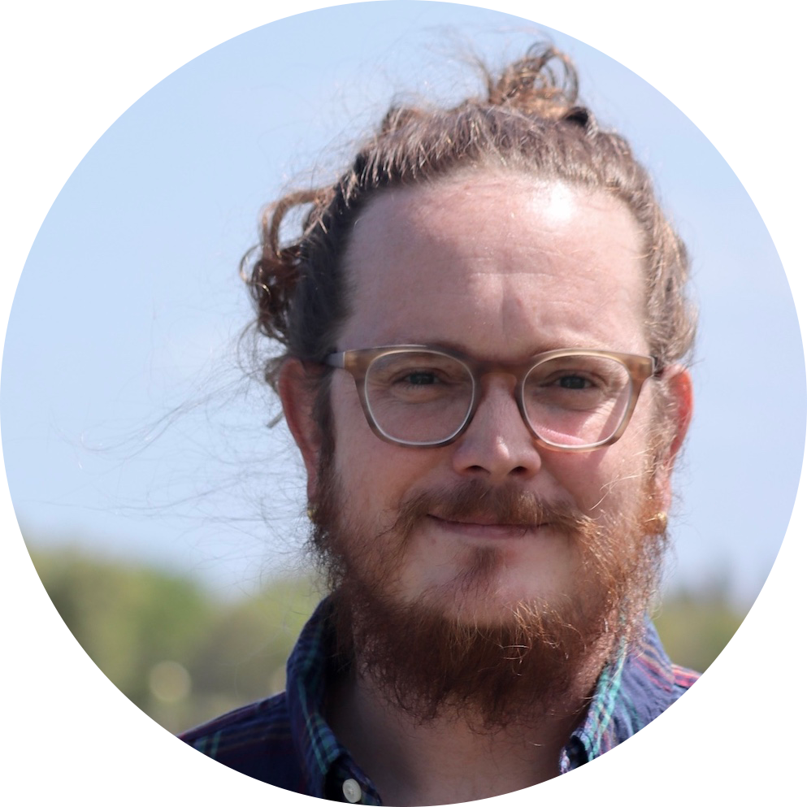

```{r, setup, include = FALSE}
knitr::opts_chunk$set(echo = FALSE, warning = FALSE, message = FALSE)
library(scholar)
library(icon)
cites = scholar::get_profile("cogphLkAAAAJ&")
```

Aside
================================================================================

{width=100%}

Ph.D. student specializing in coral reef ecology, mesophotic coral ecosystems, molecular ecology, and multivariate data analysis.


Contact Info {#contact}
--------------------------------------------------------------------------------

- <i class="fa fa-map"></i> 5600 US1 N, Ft. Pierce, FL 34946
- <i class="fa fa-phone"></i> +1 (772) 224-2396
- <i class="fa fa-envelope"></i> ryan.j.eckert@gmail.com
- `r icon::ai("google-scholar-square")` [Ryan J Eckert](https://scholar.google.com/citations?user=cogphLkAAAAJ&){target="_blank"}  
- <i class="fa fa-github"></i> [RyanEckert](https://github.com/RyanEckert){target="_blank"}  
- <i class="fa fa-twitter"></i> [CnidaRyan](https://twitter.com/CnidaRyan){target="_blank"}
- <i class="fa fa-laptop"></i> [ryanjeckert.weebly.com](http://www.ryanjeckert.weebly.com){target="_blank"}

Skills {#skills}
--------------------------------------------------------------------------------

- Coral reef ecology
- Technical SCUBA diving
- 750+ Scientific Dives
- 400+ Days at Sea
- 90+ research expeditions
- Multivariate data analysis
- NGS Library prep
- Bioinformatic analysis
- Github, Bash, R, Python

<br><br>
[<i class='fas fa-download'></i> Donwnload CV as a PDF](https://github.com/RyanEckert/Eckert_CV/raw/master/Ryan_J_Eckert_curriculum_vitae.pdf){target="_blank"}

Main
================================================================================

Ryan J. **Eckert** {#title}
--------------------------------------------------------------------------------

### Coral reef ecology, mesophotic coral ecosystems, molecular ecology


Education {data-icon=graduation-cap}
--------------------------------------------------------------------------------

### Ph.D. Student in Integrative Biology
Florida Atlantic University

Boca Raton, FL

expected 2024 - 2019

Advisor: Dr. Joshua Voss

### M.Sc. in Biological Sciences
Florida Atlantic University

Boca Raton, FL

2019 - 2017

Thesis: Population genetics and algal symbiont communities of the coral species *Montastraea cavernosa* on the Belize Barrier Reef<br>
Advisor: Dr. Joshua Voss

### B.Sc. in Biological Sciences
Florida State University

Tallahassee, FL

2009 - 2005

Thesis: Associational resistance and susceptibility in *Solanum carolinense*


Research Experience {data-icon=flask}
--------------------------------------------------------------------------------

### Graduate Research Assistant

FAU, Harbor Branch Oceanographic Institute

Ft. Pierce, FL

Present - 2017

Voss Laboratory

### Research Specialist

NOAA’s Flower Garden Banks NMS

Galveston, TX

2017 - 2009 

Science Division

### Research Assistant

Florida State University

Tallahassee, FL

2009 - 2007

Underwood Laboratory


Teaching Experience {data-icon=school}
--------------------------------------------------------------------------------

### Graduate Teaching Assistant
FAU Harbor Branch Oceanographic Institute

Ft. Pierce, FL

2017

Marine Biodiversity

### Guest Lecturer
Texas A&M University at Galveston

Galveston, TX

2014 - 2013

Scientific Diving Field Survey Methods

### Instructor
Galveston Independent School District

Galveston, TX

2010

21^st^ Century ACE


Students Mentored {data-icon=chalkboard-teacher}
--------------------------------------------------------------------------------
### Emily Chei
**Link fellowship intern**<br>
Assessing population connectivity of the coral *Montastraea cavernosa* along the northern Florida Reef Tract

N/A

2018

Currently a student at Cornell University

### Ashley Reaume 
**Link fellowship intern**<br>
Optimized extraction and amplification of algal symbiont DNA from TRIzol preserved corals

N/A

2017

Currently a graduate student at University of Central Florida


Refereed Publications {data-icon=newspaper}
--------------------------------------------------------------------------------
### 11. Depth influences Symbiodiniaceae associations among <br>*Montastraea cavernosa* corals on the Belize Barrier Reef

*Front Microbiol* (2020). [doi:10.3389/fmicb.2020.00518](https://doi.org/doi:10.3389/fmicb.2020.00518){target=_blank}

N/A

2020

**Eckert RJ**, Reaume AM, Sturm AB, Studivan MS, and Voss JD 

### 10. Population structure of the scleractinian coral, *Montastraea cavernosa*, in Southeast Florida

*Bull Mar Sci* (2020). [doi:10.5343/bms.2019.0074](https://doi.org/10.5343/bms.2019.0074){target=_blank}

N/A

2020

Dodge DL, Studivan MS, **Eckert RJ**, Chei E, Beal J, Voss JD

### 9. Populations of the coral species *Montastraea cavernosa* on the Belize Barrier Reef lack vertical connectivity

*Sci Rep* (2019). [doi:10.1038/s41598-019-43479-x](https://doi.org/10.1038/s41598-019-43479-x){target=_blank}

N/A

2019

**Eckert RJ**, Studivan MS, Voss JD
<br>

:::aside
- **Citations: `r cites$total_cites`**

- **h-index: `r cites$h_index`**

- **i10-index: `r cites$i10_index`**
:::

### 8. The Mesoamerican Reef 

In: Loya Y, Puglise KA, Bridge TCL (eds) Mesophotic Coral Ecosystems of the World. Springer International Publishing, Cham, pp 71–84. [doi:10.1007/978-3-319-92735-0_5](https://doi.org/10.1007/978-3-319-92735-0_5){target=_blank}

N/A

2019

Gress E, Voss JD, **Eckert RJ**, Rowlands G, Andradi-Brown DA

### 7. Coral bleaching and recovery from 2016 to 2017 at East and West Flower Garden Banks, Gulf of Mexico

*Coral Reefs* (2019). [doi:10.1007/s00338-019-01788-7](https://doi.org/10.1007/s00338-019-01788-7){target=_blank}

N/A

2019

Johnston MA, Hickerson EL, Nuttall MF, Blakeway RD, Sterne TK, **Eckert RJ**, Schmahl GP

### 6. Localized coral reef mortality event at East Flower Garden Bank, Gulf of Mexico

*Bull Mar Sci* (2019). [doi:10.5343/bms.2018.0057](https://doi.org/10.5343/bms.2018.0057){target=_blank}

N/A

2019

Johnston MA, Nuttall MF, **Eckert RJ**, Blakeway RD, Sterne TK, Hickerson EL, Schmahl GP, Lee MT, MacMillan J, Embesi JA

### 5. Seasonal variability of carbonate chemistry and decadal changes in waters of a marine sanctuary in the Northwestern Gulf of Mexico

*Mar Chem* (2018). [doi:10.1016/j.marchem.2018.07.006](https://doi.org/10.1016/j.marchem.2018.07.006){target=_blank}

N/A

2018

Hu X, Nuttall MF, Wang H, Yao H, Staryk CJ, McCutcheon MR, **Eckert RJ**, Embesi JA, Johnston MA, Hickerson EL, Schmahl GP, Manzello D, Enochs IC, DiMarco S, Barbero L

### 4. Persistence of coral assemblages at East and West Flower <br>Garden Banks, Gulf of Mexico

*Coral Reefs* (2016). [doi:10.1007/s00338-016-1452-x](https://doi.org/10.1007/s00338-016-1452-x){target=_blank}

N/A

2016

Johnston MA, Embesi JA, **Eckert RJ**, Nuttall MF, Hickerson EL, Schmahl GP

### 3. Rapid invasion of Indo-Pacific lionfishes *Pterois volitans* <br>(Linnaeus, 1758) and *P. miles* (Bennett, 1828) in Flower Garden Banks National Marine Sanctuary, Gulf of Mexico, documented in multiple data sets

*BioInvasions Rec* (2016). [doi:10.3391/bir.2016.5.2.09](https://doi.org/10.3391/bir.2016.5.2.09){target=_blank} 

N/A

2016

Johnston MA, Nuttall MF, **Eckert RJ**, Embesi JA, Sterne TK, Hickerson EL, Schmahl GP

### 2. Lionfish (*Pterois volitans* [Linnaeus, 1758] and *P. miles* <br>[Bennett, 1828]) records within mesophotic depth ranges on <br>natural banks in the Northwestern Gulf of Mexico 

*BioInvasions Rec* (2014). [doi:10.3391/bir.2014.3.2.09](https://doi.org/10.3391/bir.2014.3.2.09){target=_blank}

N/A

2014

Nuttall MF, Johnston MA, **Eckert RJ**, Embesi JA, Hickerson EL, Schmahl GP

### 1. Flower Garden Banks – A refuge in the Gulf of Mexico? 

In: Yellowlees D, Hughes TP (eds) Proceedings of the 12th International Coral Reef Symposium (2012).

N/A

2012

Hickerson EL, Schmahl GP, Johnston MA, Nuttall MF, Embesi JA, **Eckert RJ**

Manuscripts in preparation {data-icon=pencil-alt}
--------------------------------------------------------------------------------
### Population genetic structure of the great star coral, Montastraea cavernosa, across the Cuban archipelago with comparisons between microsatellite and SNP markers

*Sci Rep* (in revision).

N/A

N/A

Sturm AB, **Eckert RJ**, González Méndez J, González Díaz SP, Voss, JD

### Benthic community composition of mesophotic coral ecosystems in the northwest Gulf of Mexico, with comparisons to Flower <br>Garden Banks National Marine Sanctuary

*Front Mar Sci* (in prep).

N/A

N/A

Voss JD, Studivan MS, **Eckert RJ**, Williams MA, Clark RD

Technical Reports {data-icon=book .break-before-me}
--------------------------------------------------------------------------------
### Stetson Bank Long-term monitoring: 2016 annual report

Marine Sanctuaries Conservation Series ONMS-19-02. U.S. Department of Commerce, NOAA, FGBNMS, Galveston, TX.

N/A

2018

Nuttall MF, Sterne TK, **Eckert RJ**, Hu X, Sinclair J, Hickerson EL, Embesi JA, Johnston MA, Schmahl GP 

### Long-term monitoring at East and West Flower Garden Banks: 2016 annual report 

Marine Sanctuaries Conservation Series ONMS-17-09. U.S. Department of Commerce, NOAA, FGBNMS, Galveston, TX.

N/A

2017

Johnston MA, Sterne TK, **Eckert RJ**, Nuttall MF, Embesi JA, Walker RD, Hu X, Hickerson EL, Schmahl GP

### Long-term monitoring at Stetson Bank, Flower Garden Banks <br>National Marine Sanctuary, 2015 annual report

Marine Sanctuaries Conservation Series ONMS-17- 06. U.S. Department of Commerce, NOAA, FGBNMS, Galveston, TX.

N/A

2017

Johnston MA, Sterne TK, **Eckert RJ**, Nuttall MF, Embesi JA, Walker RD, Hu X, Hickerson EL, Schmahl GP

### Long-term monitoring at the East and West Flower Garden Banks National Marine Sanctuary, 2013–2015, volume 1: technical report 

U.S. Dept. of Interior, Bureau of Ocean Energy Management, Gulf of Mexico OCS Region, New Orleans, LA. OCS Study BOEM 2017-058.

N/A

2017

Johnston MA, **Eckert RJ**, Nuttall MF, Sterne TK, Embesi JA, Manzello DP, Hickerson EL, Schmahl GP 

### Long-term monitoring at East and West Flower Garden Banks: 2015 annual report

U.S. Marine Sanctuaries Conservation Series ONMS-16-02. U.S. Department  of  Commerce,  National  Oceanic  and  Atmospheric  Administration,  Flower  Garden  Banks  National Marine Sanctuary, Galveston, TX.

N/A

2016

Johnston MA, **Eckert RJ**, Sterne TK, Nuttall MF, Hu X, Embesi JA, Hickerson EL, Schmahl GP

### Long-term monitoring at East and West Flower Garden Banks <br>National Marine Sanctuary: 2014 annual report

U.S. Department of Commerce, NOAA, FGBNMS, Galveston, TX.

N/A

2015

Johnston MA, Sterne TK, **Eckert RJ**, Nuttall MF, Embesi JA, Walker RD, Hu X, Hickerson EL, Schmahl GP

### Long-term monitoring at East and West Flower Garden Banks <br>National Marine Sanctuary, 2011–2012, volume 1: technical report

U.S. Dept. of Interior, Bureau of Ocean Energy Management, Gulf of Mexico OCS Region, New Orleans, Louisiana. OCS Study BOEM 2015-027.

N/A

2015

Johnston MA, Nuttall MF, **Eckert RJ**, Embesi JA, Slowey NC, Hickerson EL, Schmahl GP

### Long-term monitoring at East and West Flower Garden Banks <br>National Marine Sanctuary: 2013 annual report

U.S. Department of Commerce, NOAA, FGBNMS, Galveston, TX.

N/A

2014

Johnston MA, Nuttall MF, **Eckert RJ**, Embesi JA.

### Long-term monitoring at the East and West Flower Garden Banks National Marine Sanctuary, 2009–2010, volume 1: technical report

U.S. Dept. of Interior, Bureau of Ocean Energy Management, Gulf of Mexico OCS Region, New Orleans, Louisiana. OCS Study BOEM 2013-214.

N/A

2013

Johnston MA, Nuttall MF, **Eckert RJ**, Embesi JA, Slowey NC, Hickerson EL, Schmahl GP

Presentations {data-icon=comment-alt}
--------------------------------------------------------------------------------

### Genetically distinct depth-stratified *Montastraea cavernosa* coral populations on the Belize Barrier Reef harbor relatively <br>homogenous Symbiodiniaceae communities 

48th Annual Benthic Ecology Meeting

St. John’s, NL, Canada

2019

**Eckert RJ**, Reaume A, Voss JD<br>
**Oral presentation**
 
### Populations of the coral species *Montastraea cavernosa* lack <br>vertical connectivity on the Belize Barrier Reef

ASLO Aquatic Sciences Meeting

San Juan, PR.

2019

**Eckert RJ**, Studivan MS, Voss JD<br>
**Poster presentation** 

### Affordable and ecologically relevant graduate research on the world’s second largest barrier reef? You better Belize it!

HBOI Science Seminar

Ft. Pierce, FL.

2018

**Eckert RJ** and Studivan MS<br>
**Oral presentation**

### Connected corals: population genetics of *Montastraea cavernosa* on the Belize Barrier Reef

HBOI Ocean Discovery Center Marine Science Friday

Ft. Pierce, FL.

2018

**Eckert RJ**<br>
**Oral presentation**

### Breaking point: population genetics reveal a lack of vertical <br>connectivity of *Montastraea cavernosa* on the Belize Barrier Reef

47th Annual Benthic Ecology Meeting 

Corpus Christi, TX.

2018

**Eckert RJ**, Studivan MS, Voss JD<br>
**Oral presentation**

### Ciguatera fish poisoning in the northwestern Gulf of Mexico. 

66th Gulf and Caribbean Fisheries Institute Conference

Corpus Christi, TX

2013

**Eckert RJ**, Loeffler C, Robertson A, Johnston MA, Hickerson EL, Schmahl GP<br>
**Poster presentation**

### Associational resistance and susceptibility in *Solanum carolinense*

Southeastern Ecology and Evolution Conference

Gainesville, FL.

2009

**Eckert RJ**, Kim T, Underwood N<br>
**Poster presentation**

Awards {data-icon=award}
--------------------------------------------------------------------------------

### Florida Atlantic University Presidential Fellow

N/A

N/A

2021 - 2019

### Florida State University Dean’s List

N/A

N/A

2009 - 2006

### Florida State University President’s List

N/A

N/A

2005
<br>

Funding {data-icon=money-bill}
--------------------------------------------------------------------------------

### FAU Presidential Fellowship

$10,000

N/A

2021 - 2019

### FAU GPSA Travel Awards

$1,600

N/A

2019 - 2018

### FAU Thesis Award

$500

N/A

2018

### PADI Foundation Grant

$4,973

N/A

2018

### Bess H. Ward Honors Thesis Award

$1,000

N/A

2009

### Florida Bright Futures Academic Scholarship

$14,850

N/A

2009 - 2005

### Florida State University Freshman Academic Scholarship

$8,000

N/A

2009 - 2005

### Florida State University Freshman AP Scholarship

$500

N/A

2005
<br>

Certifications {data-icon=id-card .break-before-me}
--------------------------------------------------------------------------------

### AAUS Scientific Diver 

190’, Trimix

N/A

N/A

### TDI Technical SCUBA Diver

Advanced Nitrox, Decompression Procedures, Trimix 200’

N/A

N/A

### PADI Trimix Gas Blender

N/A

N/A

N/A

### DAN Oxygen delivery, First Aid, and CPR for scuba diving injuries

N/A

N/A

N/A

### USCG Licensed Merchant Mariner 

100 GRT

N/A

N/A

### USFWS Motorboat Operator Certification Course

N/A

N/A

N/A

### Sea-Bird Electronics technician

N/A

N/A

N/A

### NOAA Working SCUBA Diver

N/A

N/A

N/A

Skills {data-icon=toolbox}
--------------------------------------------------------------------------------

### DNA and RNA extraction, PCR, qPCR, Gel electrophoresis, NGS library preparation
N/A

N/A

N/A

### Bioinformatic analyses, multivariate statistics, and data visualization
R statistical software, Python, Bash, PRIMER7, and CPCe

N/A

N/A

### Coral sampling, benthic surveys, fish surveys, photography, <br>navigation and mapping
N/A

N/A

N/A

### Offshore field research cruise planning, logistics, and execution
N/A

N/A

N/A

### Technical SCUBA diving, operation of Nitrox compressor systems, and Trimix blending
N/A

N/A

N/A

### Setup, operation, and maintenance of oceanographic equipment
Sea-Bird Electronics, Onset HOBO, YSI

N/A

N/A

### Adobe InDesign, Adobe Illustrator, and Adobe Photoshop
N/A

N/A

N/A

### Operation, navigation, and handling of small boats
Marlinspike, and mooring buoy construction/installation/maintenance

N/A

N/A

Membership and Service {data-icon=id-card-alt .break-before-me}
--------------------------------------------------------------------------------
### Mesophotic.org

Content Editor

N/A

2020

### International Coral Reef Society

N/A

N/A

2019

### HBOI Graduate Student Association

Secretary

Ft. Pierce, FL

2019

### Association for the Studies of Limnology and Oceanography

N/A

N/A

2018

### Reviewer for: 

Scientific Reports

N/A

N/A

<br>

References {data-icon=user-friends}
--------------------------------------------------------------------------------

### Dr. Joshua Voss

Ph.D. Advisor

Florida Atlantic University

N/A

::: concise
- +1 (772) 242–2538<br>
- <br>
- <span style="padding-left:119px">jvoss2@fau.edu</span>
:::

### Dr. Adrienne Simoes-Correa

Assistant Professor

Rice University

N/A

::: concise
- +1 (713) 348-3054<br>
- <br>
- <span style="padding-left:123px">ac53@rice.edu </span>
:::

### G.P. Schmahl

Superintendent

Flower Garden Banks National Marine Sanctuary
 
N/A

::: concise
- +1 (409) 621–5151<br>
- <br>
- <span style="padding-left:62px">george.schmahl@noaa.gov</span>
:::


Disclaimer {#disclaimer style="width: var(--sidebar-width); padding-left: var(--sidebar-horizontal-padding)"}
--------------------------------------------------------------------------------
<br><br>
This curriculum vitae was made with the R package [**pagedown**](https://github.com/rstudio/pagedown).

Last updated on `r Sys.Date()`.